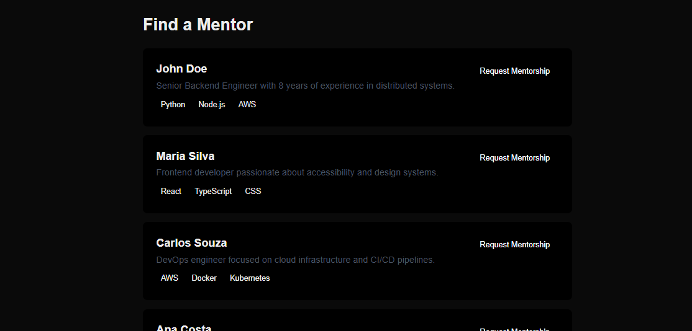

# MentorMatch

A small mentorship-matching platform where mentees can browse mentors and send mentorship requests. Built to learn a stack I hadn't worked with before (React, Next.js, TypeScript, Supabase, Vercel) after a conversation about a role using these technologies.



https://mentormatch-topaz.vercel.app/

## What it does

- Users can sign up and log in
- Mentees can browse a list of mentors with their bio and skills
- Mentees can send a mentorship request to a mentor
- Data is stored in a real Postgres database with row-level security, so users can only access their own data

## Tech stack

- **Next.js** (App Router) + **React** + **TypeScript**
- **Tailwind CSS** for styling
- **Supabase** for authentication and the database (PostgreSQL)
- **Vercel** for deployment

## How it's structured

- Pages that just read data (like the mentors list) are Server Components, they fetch directly from Supabase on the server before rendering the page.
- Pages that need user interaction (login, signup, sending a request) are Client Components, and talk to Supabase from the browser.
- Middleware keeps the login session in sync between the browser and the server.

## On AI usage

I hadn't worked with this stack before, so I used AI (Claude) as a learning tool while building this, mainly to explain concepts I didn't know (Server vs Client Components, how Supabase auth works, RLS policies) and to help me debug issues as they came up. I wrote and understand the code, but I want to be upfront that AI was part of how I learned and built this over the weekend.

## Running it locally

```bash
npm install
npm run dev
```

You'll need a `.env.local` file with: